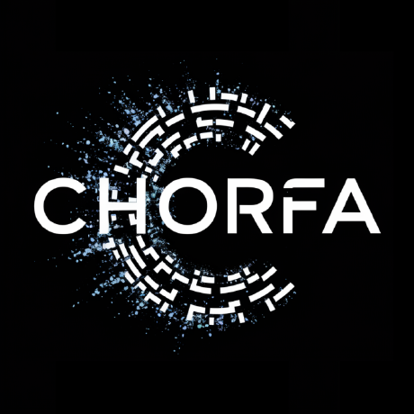

  

# 3D Viewer

## Description

3D Viewer permet de visualiser vos fichiers 3D.

**Auteur :** CHORFA Allaeddine  
**Site :** [chorfa.fr](https://chorfa.fr)  
**Contact :** [webmaster@chorfa.fr](mailto:webmaster@chorfa.fr)  
**GitHub :** [dino213dz/3D-Viewer](https://github.com/dino213dz/3D-Viewer)  
**Création :** 19 août 2026  
**Dernière mise à jour :** 21 août 2026, 22:21 CEST  

**Version :** 2.2.3

---

## Fonctionnalités de 3D Viewer

### Fonctionnalités globales
- Menu, barre d’outils et panneau flottant
- Annuler / Refaire infini (historique par fichier)
- Compatible FBX / GLB / GLTF / ZIP (contenant les formats précédents)
- Modification de matériaux
- Clic sur l’objet → bulle nom du matériau + sélection dans l’éditeur de matériaux
- Ajout et paramétrage des lumières
- Wireframe, cadrage auto, propriétés du fichier, sauvegarde des modifications (matériaux)

### Autres
- Double-clic sur un élément pour le cadrer
- Double-clic sol → éditeur de sol ; double-clic lumière → panneau lumière
- Menu contextuel (clic droit)
- Gizmo d’axes (X rouge, Y vert, Z bleu)
- Sol : quadrillage, surface plate ou aucun (éditable)
- Affichage clair / sombre
- Langues : Français, English (défaut English, mémorisée)
- Rotation des lumières, cônes masquables, lumières renommables et repliables
- Notification « MAJ disponible ! » si une version plus récente est sur GitHub

---

## Historique des versions

### 2.2.3 — 21 août 2026, 22:21 CEST
- Liste matériaux : le nom et la pastille se mettent à jour à chaque sélection (clic liste / clic 3D)
- Sections matériaux : bouton − / + bien visible à droite du titre
- Cadrer zone visible : centre et zoom dans la zone libre (hors panneaux)

### 2.2.2 — 21 août 2026, 22:10 CEST
- Fix critique : syntaxe `doFrameVisible` cassée qui bloquait tout le JavaScript

### 2.2.1 — 21 août 2026, 22:00 CEST
- Liste matériaux : mise à jour correcte du nom / pastille à chaque sélection
- Sections matériaux : icône − / + à droite du titre
- Cadrer zone visible : place l’objet dans la zone libre (hors panneaux)

### 2.2.0 — 21 août 2026, 21:14 CEST
- Propriétés fichier : nom et taille mis à jour au changement de fichier
- Matériaux : groupes collapsibles (Couleurs / Propriétés / Texture)
- Bouton Appliquer rapide (✓) en haut à gauche de la barre de titre matériaux
- Cadrer l’objet : zoom ajusté pour remplir la fenêtre sans dépasser
- Aide : fermeture au clic extérieur
- Barre d’état plus compacte
- Cadrer zone visible : meilleure prise en charge mobile paysage

### 2.1.9 — 21 août 2026, 19:30 CEST
- Options Sol déplacées dans Menu > Éditer
- Mode clair : plus de bleu, accent orange ; listes déroulantes gris fenêtre
- Alignement vertical des liens du menu
- Liste matériaux : pastille couleur dans chaque ligne (plus de carré à droite du select)

### 2.1.8 — 21 août 2026, 19:07 CEST
- Icône fermeture fenêtre en X clair
- Bouton « Réinitialiser le sol »
- Cartes lumières adaptées au mode clair
- Fix data-lang Français (data-lang="fr") ; seule la langue active en surbrillance
- Liens À propos : noir (clair) / blanc (sombre), sans accent

### 2.1.7 — 21 août 2026, 18:38 CEST
- Barre de titre : titre et boutons centrés verticalement (plus collés en haut)
- Mode clair : liens À propos visibles (orange)
- Mode clair mobile : menu clair (plus sombre)

### 2.1.6 — 21 août 2026, 18:25 CEST
- Mode clair : fenêtre À propos adaptée (plus sombre)
- Boutons fenêtre correctement à droite
- Surbrillance mode clair en orange `#F54927`
- À propos : « (Version à jour) » vert ou « (Mettre à jour) » rouge + lien GitHub
- Langue active seule en surbrillance dans le menu

### 2.1.5 — 21 août 2026, 18:06 CEST
- Fenêtre Ouvrir : un seul bouton fermer, aligné à droite
- Double-clic lumière → panneau lumières (focus)
- Sol : édition uniquement au double-clic (plus au simple clic ni clic droit)
- Langue active seule en surbrillance
- Boutons fenêtre monochromes ; barre de titre plus fine
- Titre À propos : « About 3D Viewer » / « À propos de 3D Viewer »
- Vérification version GitHub (README) + badge MAJ disponible
- Aide : contrôles souris/tactile détaillés (clic droit + glisser = pan)
- Libération des textures à l’effacement / nouveau fichier
- README : ligne Version isolée + historique complet

### 2.1.4 — 21 août 2026, 17:20 CEST
- Langue par défaut : English ; préférence sauvegardée (localStorage)
- Fix critique : crash TDZ sur currentLang qui empêchait le chargement de modele.glb
- Chargement du modèle par défaut rétabli

### 2.1.3 — 21 août 2026, 17:08 CEST
- Barre d’état en bas (messages + info matériau)
- Boutons fenêtre − + × à droite ; marges barre de titre
- Traduction EN étendue
- Marges Aide / À propos / Langues

### 2.1.2 — 21 août 2026, 16:37 CEST
- Correction menu mobile : se ferme au clic sur un lien ou en dehors

### 2.1.1 — 21 août 2026, 16:25 CEST
- Traduction FR/EN interface
- Sous-menu Sol transparent
- Labels dynamiques Afficher / Masquer
- Menu contextuel clic droit
- Édition du sol ; swatch matériau
- Thème clair Windows 3.11, accent #F54927

### 2.1.0 — 21 août 2026, 15:30 CEST
- Textures GLB / colorSpace
- Langues FR/EN ; modele.glb ; logo.png
- Aide, propriétés fichier, gizmo labels X/Y/Z
- Lumières réduisibles / renommables
- Sol quadrillage / surface / aucun
- Double-clic cadrage élément

### 2.0.3 — 20 août 2026
- Gizmo dans menu Vue
- Sélecteurs de couleur synchronisés

### 2.0.2 — 20 août 2026
- Réinitialiser couleur du ciel
- Afficher / masquer les gizmo
- Matériaux regroupés par nom

### 2.0.1 — 20 août 2026
- Fermeture sous-menus au clic barre
- Rotation des lumières X/Y/Z
- Gizmo d’axes ; couleur du ciel

### 2.0.0 — 20 août 2026 *(majeure)*
- Accent #6761FF ; matériaux numérotés alphabétiques
- Clic 3D → bulle matériau ; logo À propos

### 1.7.9 — 20 août 2026
- README historique ; tooltips barre ; liens visités

### 1.7.8 — 20 août 2026
- Toggle Matériaux / Lumières ; icônes À propos

### 1.7.7 — 20 août 2026
- Lien GitHub À propos ; raccourcis barre

### 1.7.6 — 20 août 2026
- Un seul sous-menu ouvert à la fois

### 1.7.5 — 20 août 2026
- Aide raccourcis ; accent #6761FF ; propriétés fichier

### 1.7.4 — 20 août 2026
- Historique Annuler/Refaire par fichier

### 1.7.3 — 20 août 2026
- Cadrage zone visible corrigé

### 1.7.2 — 20 août 2026
- Repositionnement fenêtres portrait/paysage
- Cadrer zone visible

### 1.7.1 — 20 août 2026
- Fix 2e application matériau ; Redo ; hex couleurs

### 1.7.0 — 20 août 2026
- Annuler barre ; icônes SVG ; échelle texture X/Y/Z

### 1.6.9 — 20 août 2026
- Fix syntaxe performUndo

### 1.6.8 — 20 août 2026
- Menu Fichier → Éditer → Vue ; Annuler barre

### 1.6.7 — 20 août 2026
- Menu Éditer ; Annuler illimité + Ctrl+Z

### 1.6.6 — 20 août 2026
- Transparence 66 %

### 1.6.5 — 19–20 août 2026
- Aucune fenêtre au démarrage

### 1.6.4 — 19–20 août 2026
- Fenêtre Charger un fichier (drag & drop)

### 1.6.3 — 19–20 août 2026
- Réinitialiser matériaux d’origine

### 1.6.2 — 19–20 août 2026
- Chargement uniquement via menu Fichier

### 1.6.1 — 19–20 août 2026
- Auteur CHORFA Allaeddine ; modèle par défaut

### 1.6.0 — 19 août 2026
- Fenêtres glass flottantes

### 1.5.x — 19 août 2026
- Menu responsive ; sélection matériau conservée

### 1.4.x – 1.2.x — 19 août 2026
- Matériaux, lumières, wireframe, ZIP/FBX/glTF

### 1.0 – 1.1 — 19 août 2026
- Première version (Car3D Tester → 3D Viewer)

---

## Formats supportés

| Extension | Notes |
|-----------|--------|
| `.glb` / `.gltf` | glTF 2.0 (textures embarquées) |
| `.fbx` | FBXLoader |
| `.zip` | Archive FBX/glTF + textures |

---

© 2026 CHORFA Allaeddine — [chorfa.fr](https://chorfa.fr)
